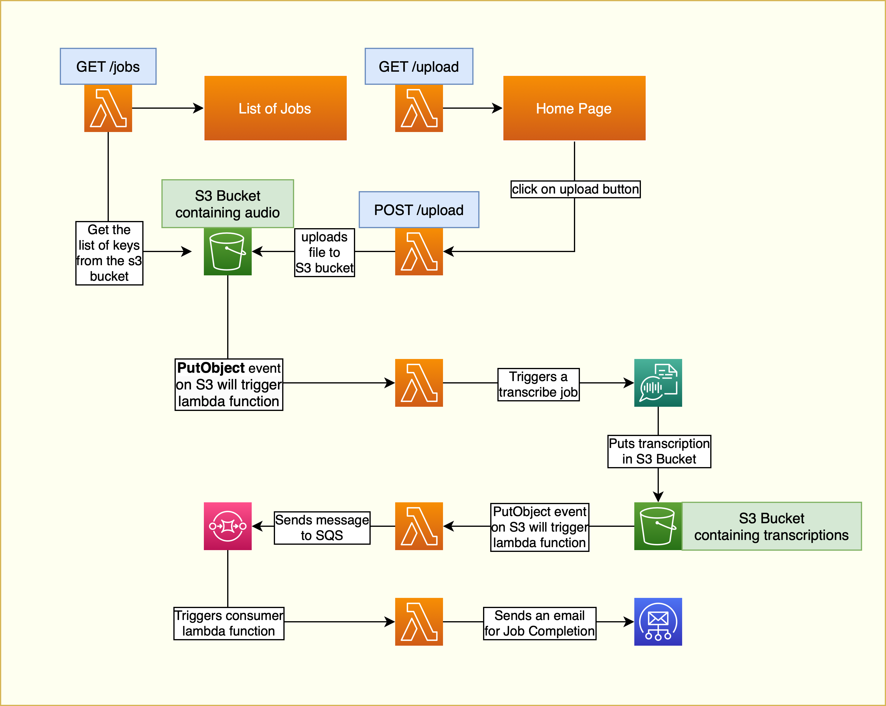

# Serverless Transcription App 

| Key          | Value                                                                |
| ------------ | -------------------------------------------------------------------- |
| Environment  |  |
| Services     | Transcribe, S3, Lambda, SQS, SES                                     |
| Integrations | Serverless Framework, AWS CLI, Serverless Lift Pluglin, AWS SDK      |
| Categories   | Serverless, Event-driven architecture, S3 Trigger, LocalStack developer endpoints |
| Level        | Intermediate                                                         |
| Github       | [Repository link](https://github.com/localstack/sample-transcribe-app) |                                                 

## Introduction

Our Transcription App is designed to simplify and streamline the process of transcribing audio files. With this app, you can upload your audio files and receive a transcript in a matter of minutes. Here's how it works:

1. **Lambda Function Serves Frontend:**
When you navigate to our `ServiceEndpoint`, a lambda function will serve a user-friendly frontend. From there, you can choose to upload an audio file or view existing transcription jobs.

2. **Uploading Audio File and Triggering Transcription:** When you select a file and click upload, the file will be uploaded to an S3 bucket, which will trigger a transcription job. The transcription job will convert the audio file into a transcription JSON file. The JSON file will then be uploaded to another S3 bucket.

3. **Email Notification of Job Completion:** Once the transcription job is complete and the transcription JSON is uploaded to S3, an email will be sent to the end user using SES (Simple Email Service) to notify them of the job completion. This email will contain the transcripted content of the audio file. You can use the [SES developer endpoint](https://docs.localstack.cloud/user-guide/aws/ses/) to list messages that were sent via SES:

```bash
curl -s http://localhost.localstack.cloud:4566/_aws/ses
```

4. **Viewing and Downloading Transcription:** To view and download the transcription, you can click on the "List Jobs" button on the frontend. This will display a list of all your completed transcription jobs, along with a link to download the transcription JSON file.

Our Transcription App leverages the power of AWS services such as Lambda, S3, Transcribe, and SES to provide you with a simple, efficient, and cost-effective solution for transcribing your audio files.

## Architecture overview

Here's an architecture diagram of the application:


### Pre-requisites:
You need few things installed on your machine before you can deploy the application on LocalStack:
- LocalStack Pro with the [`localstack` CLI](https://docs.localstack.cloud/getting-started/installation/#localstack-cli).
- [AWS CLI](https://docs.localstack.cloud/user-guide/integrations/aws-cli/) with the [`awslocal` wrapper](https://docs.localstack.cloud/user-guide/integrations/aws-cli/#localstack-aws-cli-awslocal).
- [Serverless Framework](https://www.npmjs.com/package/serverless).
- [Serverless LocalStack Plugin](https://www.npmjs.com/package/serverless-localstack)
- [Serverless Lift Plugin](https://www.npmjs.com/package/serverless-lift)
- [Node.js](https://nodejs.org/en/download/) with `npm` package manager.

Start LocalStack Pro with the `LOCALSTACK_API_KEY` pre-configured:

```shell
export LOCALSTACK_API_KEY=<your-api-key>
localstack start
```

> If you prefer running LocalStack in detached mode, you can add the `-d` flag to the `localstack start` command, and use Docker Desktop to view the logs.

## Instructions

You can build and deploy the sample application on LocalStack by running our `Makefile` commands. Run `make deploy` to create the infrastructure on LocalStack. Run `make stop` to delete the infrastructure by stopping LocalStack.

## Testing the application

To use the application, please follow the steps outlined below:

1. Access the application’s user interface by visiting the `ServiceEndpoint` URL specified in the output of the `make deploy` command; with `upload` static route parameter; after deployemnt of the app, eg: `https://vmvs1am212p.execute-api.localhost.localstack.cloud:4566/local/upload`. 


2. Click on the `Upload` button to upload a file; you can choose one on the files from `sample-audio-files` folder; to the designated S3 bucket (i.e., `aws-node-sample-transcribe-s3-local-records`).
3. Allow sufficient time for the Lambda function:`aws-node-sample-transcribe-s3-local-transcribe` to process the uploaded file.
4.  The Lambda function will create a transcription job with the record uploaded in **step 2** and push the resulting output JSON file to an S3 bucket (i.e., `aws-node-sample-transcribe-s3-local-transcriptions`).
5. Upon completion of the file processing, the UI will display the transcription output. Click the `List all jobs` button to view it.


6. The transcription can be downloaded by selecting the **jobname.json** link.
7. To verify that the email has been sent correctly, use the internal LocalStack SES endpoint at `http://localhost.localstack.cloud:4566/_aws/ses`.
