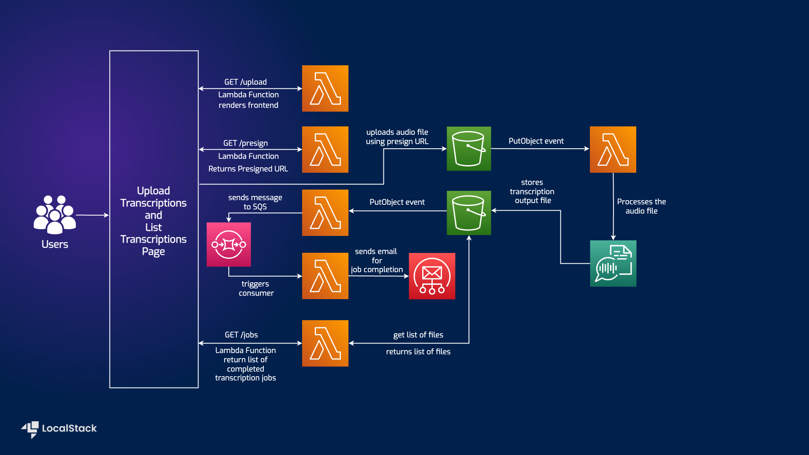
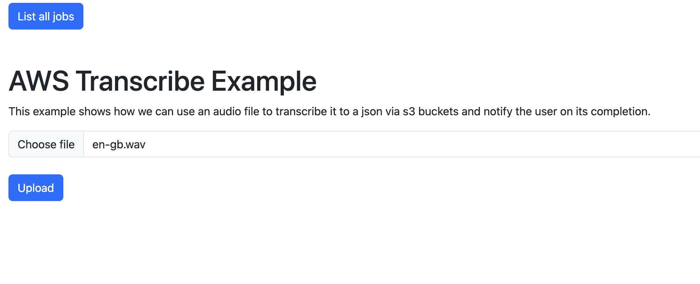
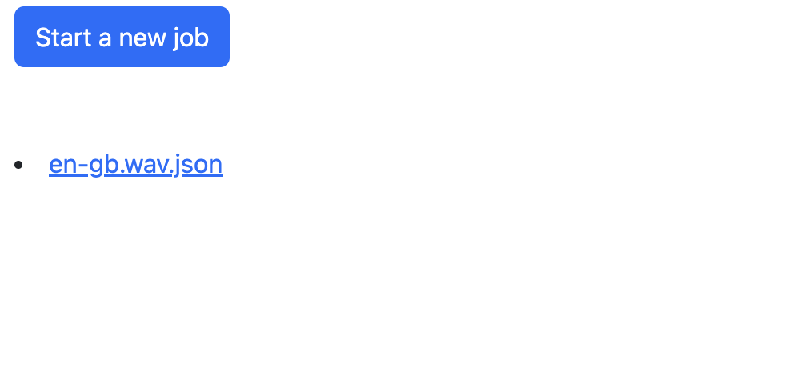

# Serverless Transcription App 

| Key          | Value                                                                |
| ------------ | -------------------------------------------------------------------- |
| Environment  |  |
| Services     | Transcribe, S3, Lambda, SQS, SES                                     |
| Integrations | Serverless Framework, AWS CLI, Serverless Lift Pluglin, AWS SDK      |
| Categories   | Serverless, Event-driven architecture, S3 Trigger, LocalStack developer endpoints |
| Level        | Intermediate                                                         |
| Github       | [Repository link](https://github.com/localstack/sample-transcribe-app) |                                                 

## Introduction

The Transcription sample application simplifies and streamlines the process of transcribing audio files. This sample application allows you to upload your audio files and receive a transcript in minutes. The sample application exposes a user-friendly web interface that allows you to upload audio files and view completed transcription jobs in an S3 bucket with an email triggered via SES to notify you of the job completion. You can further view a list of all your completed transcription jobs and a link to download the transcription JSON file. Users can deploy this application setup via the Serverless Framework on LocalStack. To test this application sample, we will demonstrate how you use LocalStack to deploy the infrastructure on your developer machine and your CI environment and invoke the transcription job on your local machine.

## Architecture diagram

The following diagram shows the architecture that this sample application builds and deploys:



We are using the following AWS services to build our infrastructure:

- [Lambda](https://docs.localstack.cloud/user-guide/aws/lambda/) to serve the frontend and process the audio file.
- [Transcribe](https://docs.localstack.cloud/user-guide/aws/transcribe/) to convert the audio file into a transcription JSON file.
- [S3](https://docs.localstack.cloud/user-guide/aws/s3/) to store the audio file and the transcription JSON file.
- [SES](https://docs.localstack.cloud/user-guide/aws/ses/) to send an email notification to the end user.

### Prerequisites

- LocalStack Pro with the [`localstack` CLI](https://docs.localstack.cloud/getting-started/installation/#localstack-cli).
- [AWS CLI](https://docs.localstack.cloud/user-guide/integrations/aws-cli/) with the [`awslocal` wrapper](https://docs.localstack.cloud/user-guide/integrations/aws-cli/#localstack-aws-cli-awslocal).
- [Serverless Framework](https://www.npmjs.com/package/serverless) with [Serverless LocalStack Plugin](https://www.npmjs.com/package/serverless-localstack) and [Serverless Lift Plugin](https://www.npmjs.com/package/serverless-lift)
- [Node.js](https://nodejs.org/en/download/) with `npm` package manager.

Start LocalStack Pro with the `LOCALSTACK_API_KEY` pre-configured:

```shell
export LOCALSTACK_API_KEY=<your-api-key>
localstack start
```

> If you prefer running LocalStack in detached mode, you can add the `-d` flag to the `localstack start` command, and use Docker Desktop to view the logs.

## Instructions

You can build and deploy the sample application on LocalStack by running our `Makefile` commands. Run `make deploy` to create the infrastructure on LocalStack. Run `make stop` to delete the infrastructure by stopping LocalStack.

Alternatively, here are instructions to deploy it manually step-by-step.

### Install the dependencies

We use the [Serverless Framework](https://www.serverless.com/framework/docs/getting-started/) to deploy the sample application. Install the Serverless Framework and other dependencies by running the following commands:

```shell
npm install -g serverless
npm install
```

### Deploy the infrastructure

We will use the `serverless deploy` command to deploy the infrastructure. This command will create the required resources on LocalStack. Run the following command to deploy the infrastructure:

```shell
sls deploy --stage local --verbose
```

> The `--stage` flag is specified to deploy the infrastructure to the `local` stage. It sets up Serverless to use the LocalStack plugin but only for the stage `local` to deploy the infrastructure to LocalStack only.

After a few seconds, the infrastructure should be deployed successfully. You will find a `ServiceEndpoint` URL specified in the output. This URL is the endpoint for the frontend application and should look similar to: `https://vmvs1am212p.execute-api.localhost.localstack.cloud:4566/local/upload`.

Next, we need to create configurations for CORS settings for our S3 bucket and verification for SES:

```shell
awslocal s3api put-bucket-cors --bucket aws-node-sample-transcribe-s3-local-records  --cors-configuration file://etc/cors.json
awslocal s3api put-bucket-cors --bucket aws-node-sample-transcribe-s3-local-transcriptions  --cors-configuration file://etc/cors.json
awslocal ses verify-email-identity --email-address sender@example.com
```

### Testing the application

Navigate to the `ServiceEndpoint` URL specified in the output of the `sls deploy` command. Specify the `upload` static route parameter to access the application. You should see a web page similar to the following:



Click on the **Upload** button to upload a file. You can choose one of the files from the `sample-audio-files` folder, which will then be uploaded to the designated S3 bucket (`aws-node-sample-transcribe-s3-local-records`).

Allow the Lambda function (`aws-node-sample-transcribe-s3-local-transcribe`) to process the uploaded file. The Lambda function will create a transcription job with the record uploaded in the previous step and push the resulting output JSON file to an S3 bucket (`aws-node-sample-transcribe-s3-local-transcriptions`).

Upon completion of the file processing, the user interface will display the transcription output. Click the **List all jobs** button to view it.



The transcription can be downloaded by selecting the **jobname.json** hyperlink. To verify that the email has been sent correctly, use the internal LocalStack SES endpoint at `http://localhost.localstack.cloud:4566/_aws/ses`.

### GitHub Actions

This application sample hosts an example GitHub Action workflow that starts up LocalStack, builds the Lambda functions, and deploys the infrastructure on the runner. You can find the workflow in the `.github/workflows/main.yml` file. To run the workflow, you can fork this repository and push a commit to the `main` branch.

Users can adapt this example workflow to run in their own CI environment. LocalStack supports various CI environments, including GitHub Actions, CircleCI, Jenkins, Travis CI, and more. You can find more information about the CI integration in the [LocalStack documentation](https://docs.localstack.cloud/user-guide/ci/).
